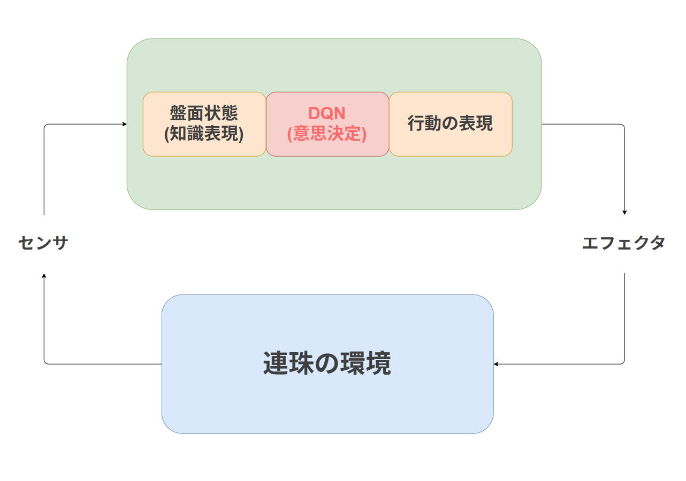
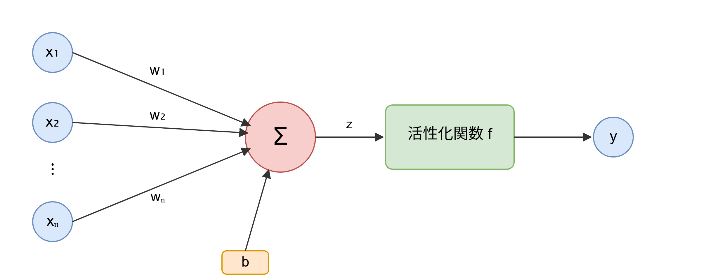
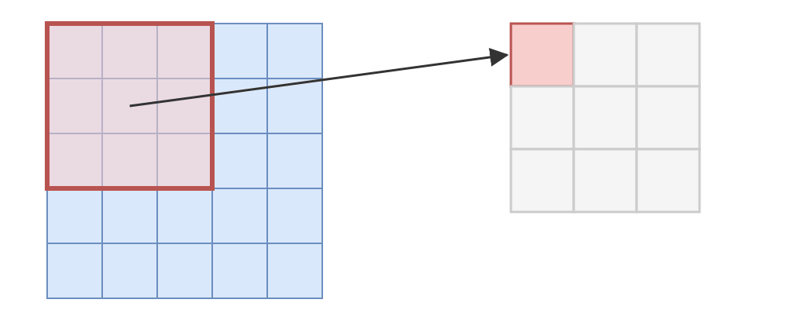
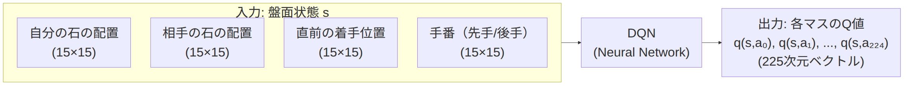
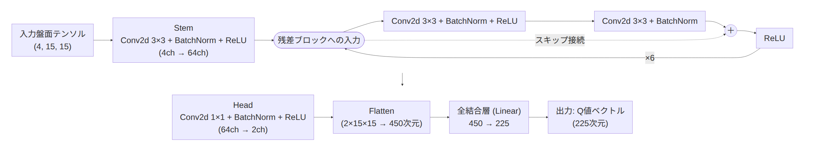
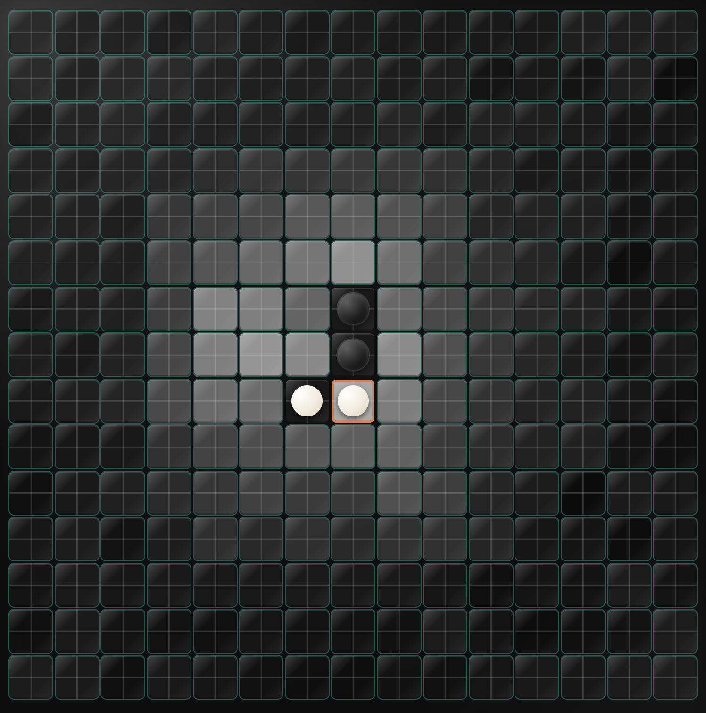
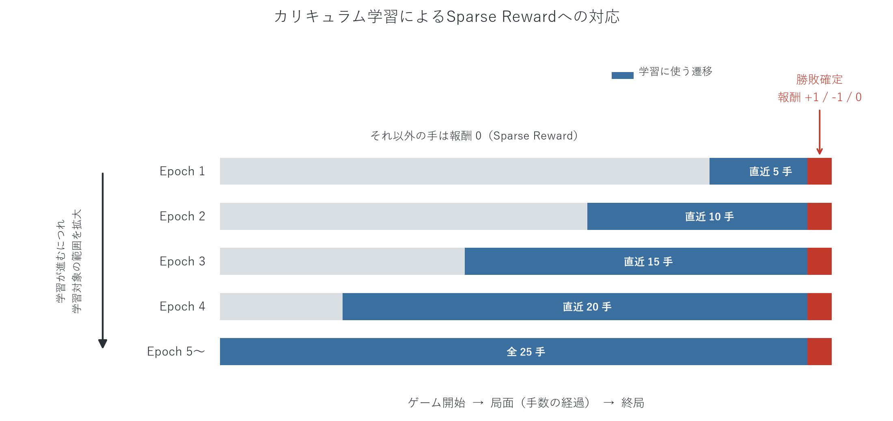
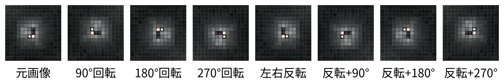

<!-- _class: lead -->

# Renju DQN

---

# 連珠とは
15×15の盤上で交互に石を置き合う，五目並べのこと．
縦横斜めのいずれかの方向に自分の石を5つ並べたら勝ちである．

## 禁手
連珠では黒番（先手）が有利すぎるため，黒にのみ以下の反則手（禁手）が課される．
黒がこれらの手を打つと，五連ができていても反則負けとなる．白（後手）には制限はない．

- **三三**: 一手で同時に2つ以上の「三」（あと一手で四になる形）ができる手
- **四四**: 一手で同時に2つ以上の「四」（あと一手で五になる形）ができる手
- **長連**: 石が6つ以上連続してしまう手（五連ではなく六連以上）

---

# DQNエージェントと対戦

まずは完成したエージェントとの対局を見てみよう．仕組みはこのあと順を追って説明する．

<video src="images/play.mp4" width="750" controls autoplay loop muted></video>

---

# エージェントアーキテクチャ

盤面状態や行動を数値でどう表現するかは人間が決める必要がある．

---

<!-- _class: lead -->

# 強化学習の基礎

---

## 強化学習とは
**エージェント**（学習する主体）が**環境**と繰り返しやりとりしながら，試行錯誤を通じて「良い行動」を学んでいく機械学習の枠組み．

1. エージェントが環境の**状態** $s$ を観測する
2. 状態をもとに**行動** $a$ を選ぶ
3. 環境から**報酬** $r$ を受け取り，状態が次の状態 $s'$ に変わる

最終的な目的は，これを繰り返して **将来にわたって得られる報酬の合計が最大になるように行動を選ぶ方法（方策）** を学習することである．

---

## 方策 $\pi$

エージェントが状態 $s$ から行動 $a$ を選ぶルールを **方策（policy）** $\pi$ と呼ぶ．

$$
\pi(a \mid s) = \text{状態 } s \text{ で行動 } a \text{ を選ぶ確率}
$$

確率的な方策だけでなく，状態から行動を一意に決める決定的な方策 $a = \mu(s)$ もある．

強化学習の目的は，累積報酬を最大化する **最適方策 $\pi^*$** を見つけることである．

---

## 状態価値関数 $V$

方策 $\pi$ に従って行動し続けたとき，状態 $s$ から将来得られる報酬の合計（期待値）を **状態価値関数** $V^\pi(s)$ と呼ぶ．

$$
V^\pi(s) = \mathbb{E}_\pi \left[ \sum_{t=0}^{\infty} \gamma^t r_t \;\middle|\; s_0 = s \right]
$$

$\gamma$ は割引率であり，将来の報酬を現在の価値に換算するための重みである．

$V^\pi(s)$ は「その状態がどれだけ良いか」を表す指標といえる．

---

## 行動価値関数 $Q$

状態 $s$ で行動 $a$ を選び，その後は方策 $\pi$ に従い続けたときに得られる報酬の合計（期待値）を **行動価値関数** $Q^\pi(s,a)$ と呼ぶ．

$$
Q^\pi(s,a) = \mathbb{E}_\pi \left[ \sum_{t=0}^{\infty} \gamma^t r_t \;\middle|\; s_0 = s,\ a_0 = a \right]
$$

$V$ が状態だけの価値であるのに対し，$Q$ は「状態でその行動をとった場合」の価値を表す．

両者には次の関係がある．

$$
V^\pi(s) = \sum_{a} \pi(a \mid s)\, Q^\pi(s,a)
$$

---

## $\pi$，$V$，$Q$ の関係と最適方策

最適方策 $\pi^*$ のもとでは，価値関数は最大値を取る．

$$
V^*(s) = \max_{a} Q^*(s,a), \qquad
\mu^*(s) = \arg\max_{a} Q^*(s,a)
$$

つまり，各状態で **最もQ値の高い行動を選ぶこと自体が最適方策** になる．

---

<!-- _class: lead -->

# Neural Network の基礎

---

## Neural Network (NN)とは
ある値を入力してある値を出力する**関数を近似するもの**がNeural Network (NN)である．

理想的な入出力のペアを人間が定義し，それをもとにしてNNが学習することで近似を達成する．

今回の場合は，盤面状態 $s$ と着手行動 $a$ からQ値というスコア $q$ を出力する関数を近似する．

$$
q = Q(s,a)
$$

NNで近似した関数は**モデル**と呼ばれる．

---

## NNの構造と重み
NNは**ニューロン**と呼ばれる小さな計算単位が層状に連なって構成される．

各ニューロンは，入力 $x_1,\dots,x_n$ に**重み** $w_1,\dots,w_n$ をかけて足し合わせ，バイアス $b$ を加えたうえで活性化関数 $f$ を通して出力 $y$ を計算する．

$$
y = f\left( \sum_{i=1}^{n} w_i x_i + b \right)
$$

NNの「学習」とは，この**重み**と**バイアス**をlossが小さくなるように少しずつ更新していくことにほかならない．

なお，この重み $w$ は後述するNoisyNetにおいてノイズを加える対象にもなる．

---

## 1層（1ニューロン）分の構造

NNはこの構造を持つニューロンを大量に並べ，何層にも重ねることで複雑な関数を表現する．

---

## Convolutional Neural Network (CNN)
画像のように，縦横に規則正しく並んだデータを扱うのに適したNNの一種．

入力全体に対して，小さなフィルタ（**カーネル**）をスライドさせながら適用し，各位置での特徴（辺や模様など）を検出する．

$$
\text{出力}(i,j) = \sum_{u,v} \text{入力}(i+u,\ j+v) \times \text{カーネル}(u,v)
$$

同じフィルタを入力全体で使い回す（**重み共有**）ため，全結合層に比べてパラメータ数を抑えつつ，位置によらず同じ特徴を検出できる．

連珠の盤面も15×15マスに石が並ぶ構造であり，画像とみなせるため，今回のモデルではCNNを採用した．

---

## カーネルのスライド

カーネルを入力の左上から順にスライドさせ，重なった範囲の値の積和を1つの出力マスとして書き込んでいく．

これを入力全体について繰り返すことで，出力（特徴マップ）の全マスが埋まる．

---

## NNの学習方法
NNの学習に必要なものはloss関数と理想的な入出力で構成された学習データである．

loss関数はモデルの出力が理想の出力からどれだけずれているかを表す指標であり，NNの学習はこのlossを減らすように行われる．

一度loss関数を定義してしまえば，コード上ではpytorchが自動的に減らす方向に計算してくれる．

---

## 一般的なloss関数
- Mean Squared Error (MSE):
$$
L = \frac{1}{N} \sum_{i=1}^{N} (y_i - \hat{y}_i)^2
$$
- Cross Entropy:
$$
L = -\frac{1}{N} \sum_{i=1}^{N} \left[ y_i \log(\hat{y}_i) + (1-y_i)\log(1-\hat{y}_i) \right]
$$

ここで $y_i$ は正解（目標値），$\hat{y}_i$ はモデルの出力（予測値），$N$ はデータ数であり，直感的には目標値と予測値の近さを数値に置き換える操作を意味する．

---

<!-- _class: lead -->

# Q-Learning

---

## Qテーブル
盤面と行動の組み合わせそれぞれに対してQ値を持つテーブルを用意する．

これをQテーブルと呼ぶ．

スコアが高いほどいい手であるとエージェント(=AI)は判断する．

| | $s_0$ | $s_1$ | $\cdots$ |
|---|---|---|---|
| $a_0 = (0,0)$ | $Q(s_0,a_0)$ | $Q(s_1,a_0)$ | $\cdots$ |
| $a_1 = (0,1)$ | $Q(s_0,a_1)$ | $Q(s_1,a_1)$ | $\cdots$ |
| $\vdots$ | $\vdots$ | $\vdots$ | $\ddots$ |
| $a_{224} = (14,14)$ | $Q(s_0,a_{224})$ | $Q(s_1,a_{224})$ | $\cdots$ |

---

## Q-Learningの更新式
Qテーブルは $0$ に近い初期値で埋め，以下の式で更新することを繰り返す．

この式にしたがって更新していくと将来的な行動も加味してスコアを振るようになっていく．

$$
Q(s,a) \leftarrow Q(s,a) + \alpha \left( r + \gamma \max_{a'} Q(s',a') - Q(s,a) \right)
$$

ここで $\alpha$ は学習率， $\gamma$ は割引率， $r$ は報酬， $s'$ は行動 $a$ をとった後の次の盤面状態である．

$r$ はその行動がどれくらい良かったのかを表すスコアであり，人間が直感に従って構成する必要がある．

---

<!-- _class: lead -->

# 作成したモデル

---

## Deep Q Network (DQN)
Q-Learningではすべての状態と行動のペアを情報として持っておく必要があるが，状態数は単純に考えても $3^{225} > 10^{100}$ と非常に多く，1つ1つを追っていくのは現実的ではない．

そこで，Q関数をNNで近似することを考える．

学習の際は，Q-Learningの更新式に出てきた目標値 $r + \gamma \max_{a'} Q(s',a')$ を「正解」とみなし，NNの出力 $Q(s,a)$ がこれに近づくようにMSEなどのloss関数で学習させる．

---

### 入力と出力

盤面を4チャンネルの画像として表現し，1回のforwardで全225マス分のQ値をまとめて出力する．

---

### アーキテクチャ

---

### 学習後のQ値

学習後のモデルにある盤面を入力し，各マスに着手した場合のQ値をヒートマップとして盤面上に表示したもの．明るいマスほどQ値が高く，良い手だとモデルが判断していることを示す．

---

<!-- _class: lead -->

## 学習の工夫

---

### カリキュラム学習
今回は報酬の定義が難しかったため，勝ち・負け・引き分けが決まる瞬間にそれぞれ $1,-1,0$ の報酬を与える形で定義し，それ以外の場合は0にした．

このように，勝敗が決まる最後の瞬間にしか与えられない報酬を **Sparse Reward** と呼ぶ．

これだと学習初期のモデルは，最後の一手以外の行動の価値を正しく評価できないため，学習が難しい．

そのため，今回はカリキュラム学習を取り入れることで，Sparse Rewardに対応した．

具体的には，終局に近い遷移から優先的に学習させ，エポックが進むごとに学習対象とする範囲を終局から徐々に過去へと広げていく．

---

### カリキュラム学習

---

### Data Augmentation
シミュレーションは学習のスピードに比べると非常に遅く，学習に十分なデータをそろえることが困難だった．

この対策として **Data Augmentation** という手法がある．

これは学習データが十分に確保できないときに，既存のデータから水増しをする手法である．

今回は，盤面を回転・反転させても本質的に同じ状態であるという性質を利用し，データの水増しを行った．

---

### Data Augmentation

1つの盤面から回転・反転によって最大8通りの学習データを作ることができる．

---

<!-- _class: lead -->

## DQNのオプション

---

### Double DQN – 課題
普通のDQNは，次の状態でどの行動が一番良いかを選ぶのも，その行動がどれくらい良いかを採点するのも，同じネットワークで行っている．

自分で選んだ手を自分で甘く採点してしまうため，Q値が実際より高く見積もられがち（過大評価）という欠点がある．

---

### Double DQN – 対策
Double DQNでは，「どの行動が一番良いか選ぶ」役と「その行動を採点する」役を別々のネットワークに分担させる．

$$
Q(s,a) \leftarrow Q(s,a) + \alpha \left( r + \gamma\, Q_{\text{target}}\bigl(s', \arg\max_{a'} Q_{\text{online}}(s',a')\bigr) - Q(s,a) \right)
$$

行動の選択は普段使っているネットワーク（online），その評価は少し古いコピーのネットワーク（target）で行うことで，
自分に都合よく採点することを防ぎ，過大評価を抑えられる．

---

### Dueling Network – 課題
盤面には，「どの手を打ってもだいたい良い（勝ちが見えている）盤面」や逆に「どう打ってもあまり変わらない盤面」がある．

通常のDQNは全ての行動のQ値をまとめて学習するため，盤面自体の価値と個々の行動の細かい差を分けて捉えることができない．

---

### Dueling Network – 対策
そこで，Q値を次の2つに分けて考える．

- $V(s)$: その盤面自体がどれくらい良いか（行動によらない価値）
- $A(s,a)$: その盤面の中で，特定の行動が他の行動と比べてどれだけ得か（アドバンテージ）

$$
Q(s,a) = V(s) + \left( A(s,a) - \frac{1}{|\mathcal{A}|}\sum_{a'} A(s,a') \right)
$$

ネットワークの出力層を $V$ と $A$ の2つに分けて，最後にこの式で合成する．

盤面全体の良し悪しと，個々の手の良し悪しを別々に学習できるため，特に「どの手を打ってもあまり差がない」ような盤面での学習が効率的になる．

---

### $\varepsilon$-greedy法 – 課題
学習中のエージェントがQ値の一番高い行動だけを選び続けると，たまたま序盤に高評価をつけた手ばかり打つようになり，本当はもっと良いかもしれない他の手を試す機会がなくなってしまう．

かといって毎回ランダムな手ばかり打っていては，Q値がいつまでも正しく学習されない．

「今知っている中で一番良い手を打つ（活用）」か「まだ試していない手をあえて打ってみる（探索）」かのバランスをどう取るかが課題となる．

---

### $\varepsilon$-greedy法 – 対策
最もシンプルな方法が $\varepsilon$-greedy法である．

$$
a =
\begin{cases}
\text{ランダムな行動} & ( \text{確率 } \varepsilon ) \\
\displaystyle\arg\max_{a'} Q(s,a') & (\text{確率 } 1-\varepsilon )
\end{cases}
$$

確率 $\varepsilon$ でランダムな行動（探索），残りの確率 $1-\varepsilon$ でその時点のQ値が最大の行動（活用）を選ぶ．

学習の初期は $\varepsilon$ を大きくして色々な手を経験させ，学習が進むにつれて $\varepsilon$ を徐々に小さくしていく（ $\varepsilon$ 減衰）ことで，序盤は探索重視，終盤は活用重視という流れを作る．

---

### NoisyNet – 課題
$\varepsilon$-greedy法の $\varepsilon$ は盤面の状況によらず一律の確率で決まるため，「もう十分学習して自信がある盤面」でも「まだあまり見たことがない盤面」でも同じ確率でランダムな手を打ってしまう．

$\varepsilon$ は人間があらかじめ決めた確率でしかなく，盤面ごとの事情を考慮していない．

---

### NoisyNet – 対策
そこで NoisyNet では，探索の度合いそのものを学習によって盤面ごとに調整できるようにする．

具体的には， $\varepsilon$ のような手動のランダム性を使う代わりに，ネットワークの重みに学習可能なノイズ（ばらつき）を加える．

$$
w = \mu + \sigma \odot \xi
$$

$\mu$（中心値）と $\sigma$ （ノイズの大きさ）はどちらも学習で更新されるパラメータで， $\xi$ は毎回サンプリングされるランダムな値である．

学習が進んで自信のある行動ほど $\sigma$ が小さくなり自然と探索が減っていくため，$\varepsilon$-greedy法のように $\varepsilon$ を人間が手動で調整・減衰させる必要がなくなる．

---

# DQNエージェントと対戦

<video src="images/play.mp4" width="750" controls autoplay loop muted></video>
